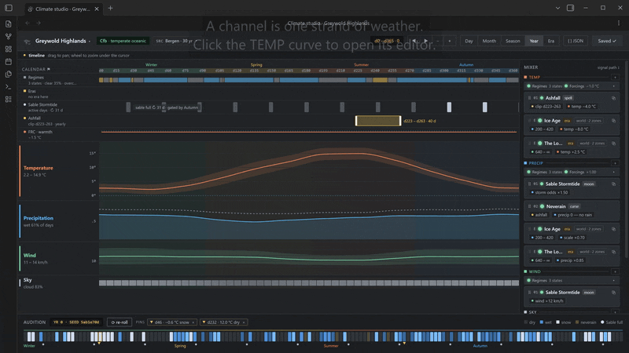
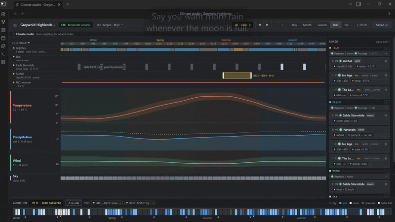
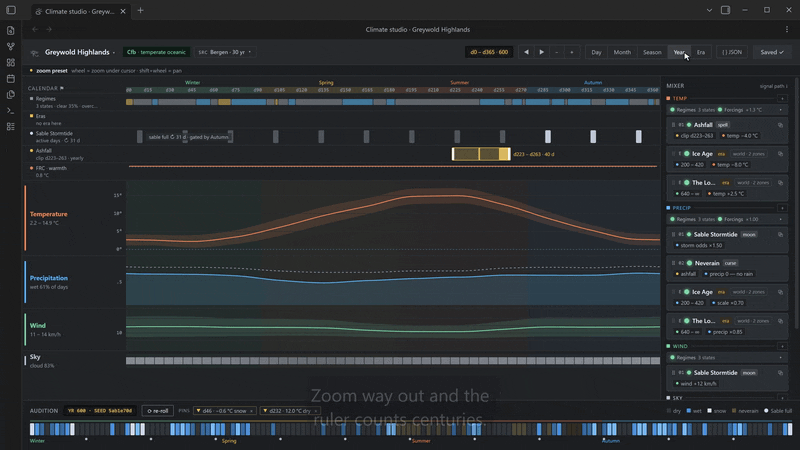

# Recipes

U+13080 is flexible and powerful even in its alpha state, but the visibility of what is possible is not the most clear. While users should expect this to both improve over alpha, as well as flexibility and support to _expand_, I will also be keeping and updating this list of examples that you can either copy paste as is or modify to play with or use directly for your world.

### Common terms and glossary

- A **modifier** lives in a zone's `modifiers` array (*Zones → Edit*). `when` says when, `apply`
  says what, `spell` gives it duration, `tag` names it on the day's card.
- An **era** lives in *Settings → Calendar → Eras* and applies to the whole world.
- Comments (`// …`) are fine in both editors.
- Everything here can also be built in the **climate studio** (*Zones → Open in studio*) without
  typing JSON. Each group below opens with the route through the studio; the recipe under it is
  what the studio would have written. The two are interchangeable — paste a recipe and the studio
  will show it as a device on save, or build it in the studio and read the JSON back out of the
  `{ } JSON` drawer.
- If you would rather watch first, the [studio overview](../media/studio-overview.mp4) walks the
  whole editor and the [first-region tutorial](../media/t1-first-region.mp4) builds a zone from
  nothing.

Parameter cheat-sheet, for reading the `apply` lists:

| param | meaning | typical range |
|---|---|---|
| `precipitation.pwd` | chance a dry day is followed by a wet one | 0–1 |
| `precipitation.pww` | chance a wet day is followed by another | 0–1 |
| `precipitation.scale` | size of a wet day's rainfall (gamma scale, mm) | 2–30 |
| `temperature.mean` | the day's mean, °C | |
| `temperature.diurnalRange` | high minus low, °C | 4–20 |
| `wind.speed` | mean wind, km/h | 5–40 |
| `wind.direction` | degrees the wind blows *from* | 0–360 |
| `cloud.dry` / `cloud.wet` | cloud cover on dry / wet days | 0–1 |
| `humidity.dry` / `humidity.wet` | relative humidity on dry / wet days | 0–1 |

`set` replaces, `offset` adds, `scale` multiplies, `clamp` bounds. Ops run in list order.

---

## Seasons

The internal calendar's seasons (*Settings → Calendar*) become tags: `season:Spring`, and so on. You do not have to define seasons; if you'd rather not, `yearPhase` ranges do the same job without names: `0` is the first day of the year, `0.5` is midsummer in a northern-hemisphere preset.

Integrating with an external calendar from another plugin, once such integrations exist, may modify this. That will be up to that plugin+the data you enter into it.



**In the studio:** `＋` on a chain → *Tag-gated* for a named season, or *Spell* for a season-shaped
run of days; set the window with the year-window mini-lane and the `apply` knobs. To edit the
seasons themselves, click `Calendar ⚑` at the top of the playlist and drag the boundary flags. For
a permanent seasonal shape rather than a device — a wetter summer, a milder winter — use the
channel editor's season scope instead: click a channel row, pick the season chip, turn the knob.

### Monsoon burst

You may want a much more aggresive wet season, one that contradicts the typical real world weather for the geography you chose: much wetter, much cloudier. Here's an example of a monsoon season that runs from a little before midsummer to early autumn. Uses `yearPhase` so it works with no seasons configured (see below "harvest fogs" example for how to reference a season for the same thing, if you wished).

```json
{
  "id": "monsoon",
  "when": { "yearPhase": [0.45, 0.72] },
  "apply": [
    { "param": "precipitation.pwd", "op": "scale", "value": 2.5 },
    { "param": "precipitation.pww", "op": "clamp", "min": 0.7 },
    { "param": "precipitation.scale", "op": "scale", "value": 1.6 },
    { "param": "cloud.dry", "op": "offset", "value": 0.25 },
    { "param": "humidity.dry", "op": "clamp", "min": 0.7 }
  ],
  "tag": "monsoon"
}
```

### Harvest fogs

Autumn mornings that start foggy and overly calm: high humidity, low wind. By default, U+13080's fog rule requires
humidity above 0.92, wind under 8 km/h and no more than drizzle — this recipe ramps the chances of it
on roughly 1/3 of "Autumn" (note that this is a named season) days rather than forcing it, so that it's still an event, not a guarantee. You could also easily tweak this to be a gaurantee, though.

```json
{
  "id": "harvest-fog",
  "when": { "all": [ { "tag": "season:Autumn" }, { "chance": 0.35 } ] },
  "apply": [
    { "param": "humidity.dry", "op": "clamp", "min": 0.94 },
    { "param": "humidity.wet", "op": "clamp", "min": 0.94 },
    { "param": "wind.speed", "op": "clamp", "max": 5 }
  ],
  "tag": "fog-morning"
}
```

### Long Winter (unnaturally long seasons, and don't speak to me of the old magic)

A named season intensified, which is colder and windier so long as the calendar says "Winter". You could then pair this with a
season that starts early and ends late (*Settings → Calendar*).

```json
{
  "id": "long-winter",
  "when": { "tag": "season:Winter" },
  "apply": [
    { "param": "temperature.mean", "op": "offset", "value": -5 },
    { "param": "wind.speed", "op": "scale", "value": 1.3 },
    { "param": "cloud.dry", "op": "offset", "value": 0.15 }
  ]
}
```

---

## Moons

Moons are declared in *Settings → Calendar* (name, cycle in days, phase at day 0). Phase runs 0 (new) →
0.5 (full) → 1 (new again); ranges wrap, so `[0.9, 0.1]` is "around new". The moon's *name* in
the modifier must match the calendar exactly.



**In the studio:** `＋` on a chain → *Moon-bound*, or the shipped **Spring-tide** preset, then pick
the moon and the phases it fires on. The device gets its own lane of pulses in the playlist; click
one to open the moon's cycle disc and drag the phase boundaries. In the device's MOD section you
can gate it to a season (softly or hard, your choice of strength) and draw an onset envelope so it swells and fades
across the phase rather than snapping on — that is the `mods` and `envelope` in the "Spring tide"
recipe below.

### Stormtide (single moon near full)

The same example from the README: wetter and windier while *Sable* is near full.

```json
{
  "id": "sable-stormtide",
  "when": { "moon": { "name": "Sable", "phase": [0.88, 1.0] } },
  "apply": [
    { "param": "precipitation.pwd", "op": "scale", "value": 1.5 },
    { "param": "wind.speed", "op": "offset", "value": 12 }
  ],
  "tag": "stormtide"
}
```

### Conjunction storms (two moons full together)

This one requires two moons, say *Sable* (29.53 days) and *Ash* (41 days). Both near full at once is made purposefully rare — the two cycles line up only every few months — so this can afford to be violent. This should be adaptable for many other "rare but extreme" events.

```json
{
  "id": "conjunction",
  "when": { "all": [
    { "moon": { "name": "Sable", "phase": [0.42, 0.58] } },
    { "moon": { "name": "Ash", "phase": [0.42, 0.58] } }
  ] },
  "apply": [
    { "param": "precipitation.pwd", "op": "clamp", "min": 0.8 },
    { "param": "precipitation.scale", "op": "scale", "value": 2 },
    { "param": "wind.speed", "op": "scale", "value": 1.8 },
    { "param": "cloud.dry", "op": "set", "value": 0.95 }
  ],
  "tag": "conjunction"
}
```

### Dark-moon calm

The opposite of above: what if around new moon the sky clears and the wind drops? 

Use `not` to keep it from firing while the stormtide above is on, if you use both.

```json
{
  "id": "dark-calm",
  "when": { "all": [
    { "moon": { "name": "Sable", "phase": [0.94, 0.06] } },
    { "not": { "tag": "stormtide" } }
  ] },
  "apply": [
    { "param": "wind.speed", "op": "scale", "value": 0.5 },
    { "param": "cloud.dry", "op": "scale", "value": 0.5 },
    { "param": "precipitation.pwd", "op": "scale", "value": 0.6 }
  ],
  "tag": "dark-calm"
}
```

### Moon-gated fog spell

A series of foggy days that can only *start* while the moon is new, and then lingers about five
days regardless. `spell` starts are drawn only on days the `when` holds; once running, the spell
ignores it. This example results in about three spells a year.

```json
{
  "id": "moonless-fogs",
  "when": { "moon": { "name": "Sable", "phase": [0.95, 0.05] } },
  "spell": { "meanStartsPerYear": 3, "meanDurationDays": 5 },
  "apply": [
    { "param": "humidity.dry", "op": "clamp", "min": 0.95 },
    { "param": "wind.speed", "op": "clamp", "max": 4 }
  ],
  "tag": "moonless-fog"
}
```

### Spring tide (a moon device, gated by season, with an onset envelope)

Everything above switches on and off at the edge of a range. This one swells and fades instead,
and one season is where it runs at full strength — everywhere else it is damped to half.

Two new pieces, both in `[0, 1]`, and neither can amplify: you author a device at the magnitude
you want at its strongest, and an envelope or a gate only ever takes it *down* from there.

- `envelope` is a list of `[phase, strength]` points sampled at the **carrier moon** — the moon
  named in `when.moon` — and interpolated between them, wrapping around the cycle. Strength is in
  `[0, 1]` and multiplies the op's *magnitude*: `[[0.4, 0], [0.5, 1], [0.6, 0]]` means the wind
  offset is 0 at the edges of the window, full at exactly full moon, and a straight ramp in
  between. `set` and `clamp` ignore envelopes (there is no half of a `set`); `offset` and `scale`
  honour them.
- `mods` is a list of **gates**, and a gate **restricts a device to its source**. The `source` is a
  *tag* — never a moon; a `moon:` source is a validation error, because a moon is the device's
  carrier (`when.moon`), not a gate. While that tag is on the day the device runs whole; on every
  *other* day its ops are multiplied by `1 − amount`. So `amount` is the gate's **strength**, in
  `[0, 1]`: `1` is a hard gate (the device is silent away from its source), `0.5` halves it away
  from its source, and `0` is no gate at all. Gates multiply, so a device with two gates runs whole
  only where *both* tags are on the day — and a gated-out device is muted, not silenced (it keeps
  its `tag`, so other rules can still react to it).

```json
{
  "id": "spring-tide",
  "when": { "moon": { "name": "Sable", "phase": [0.4, 0.6] } },
  "mods": [{ "source": "season:Summer", "amount": 0.5 }],
  "apply": [
    { "param": "wind.speed", "op": "offset", "value": 14, "envelope": [[0.4, 0], [0.5, 1], [0.6, 0]] },
    { "param": "cloud.dry", "op": "offset", "value": 0.2, "envelope": [[0.4, 0], [0.5, 1], [0.6, 0]] }
  ],
  "tag": "spring-tide"
}
```

What you should see: through most of the month, nothing. Over the six or seven days around each
full Sable the wind climbs and falls again, peaking at +14 km/h on the night of the full moon —
but only in Summer, the gate's source. Autumn full moons peak at +7, because outside `season:Summer`
the gate at `amount: 0.5` takes half of everything the device does. Raise that amount to `1` and the
spring tide stops happening outside Summer altogether.

---

## Eras

Eras are world-wide and keyed on the calendar's year numbers (note: again, this may vary with non-internal calendars). Each one tags its days with `era:<name>`, and `apply` affects every zone. Zones can then add their own reaction with an ordinary
modifier on the tag. Eras are steps, not cycles.



**In the studio:** switch the zoom to *Era* and the eras become clips on their own lane — drag an
empty stretch to create one, drag its body to move it, its edges to resize, right-click to delete,
click to open its editor and give it `apply` ops. Eras are world-level, so the lane and the mixer
card both carry a `world · N zones` badge and the first world edit of a session asks you to
confirm. A century of warming (the last recipe in this group) is not an era but an **automation
lane**: the `FRC · warmth` row lower down the playlist, where you drag points across the years.

### Ice age, thaw, long summer (a chained timeline)

Paste into *Settings → Calendar → Eras*. Years are inclusive; the last era is open-ended.

```json
[
  { "name": "Ice Age", "from": 1200, "to": 1900,
    "apply": [
      { "param": "temperature.mean", "op": "offset", "value": -8 },
      { "param": "precipitation.scale", "op": "scale", "value": 0.7 },
      { "param": "wind.speed", "op": "scale", "value": 1.2 }
    ] },
  { "name": "Thaw", "from": 1901, "to": 1950,
    "apply": [
      { "param": "temperature.mean", "op": "offset", "value": -2 },
      { "param": "precipitation.pwd", "op": "scale", "value": 1.4 }
    ] },
  { "name": "Long Summer", "from": 1951,
    "apply": [ { "param": "temperature.mean", "op": "offset", "value": 3 } ] }
]
```

### A zone that floods in the Thaw

Goes in one zone's `modifiers`; reacts to the era above. Meltwater rain on most days and a
`flood` tag other rules (or your notes) can read.

```json
{
  "id": "thaw-floods",
  "when": { "all": [ { "tag": "era:Thaw" }, { "yearPhase": [0.2, 0.5] } ] },
  "apply": [
    { "param": "precipitation.pwd", "op": "clamp", "min": 0.6 },
    { "param": "precipitation.scale", "op": "scale", "value": 1.5 }
  ],
  "tag": "flood"
}
```

### The Sunless Years (a tag-only era)

No `apply`: the era only exists as a tag, and each zone decides what it means. Good for eras
whcih are more story driven, rather than (real world) physics based, as often occurs in fantasy worlds.

```json
[ { "name": "Sunless Years", "from": 600, "to": 603 } ]
```

```json
{
  "id": "sunless",
  "when": { "tag": "era:Sunless Years" },
  "apply": [
    { "param": "cloud.dry", "op": "set", "value": 1 },
    { "param": "cloud.wet", "op": "set", "value": 1 },
    { "param": "temperature.mean", "op": "offset", "value": -4 }
  ],
  "tag": "sunless"
}
```

### A permanent warm world

If the whole zone is simply hotter and there is no "before", use a `climate`-stage modifier: it
rewrites the zone's curves once and needs nothing else. Climate-stage ops may also touch the
scalar paths (`temperature.phase`, `precipitation.freezingPoint`, …).

```json
{
  "id": "warm-baseline",
  "stage": "climate",
  "apply": [
    { "param": "temperature.mean", "op": "offset", "value": 4 },
    { "param": "precipitation.freezingPoint", "op": "set", "value": -1 }
  ]
}
```

### A century of warming (an automation lane)

An era is a step: inside it the world is one way, outside it another. A **lane** is the other
shape — a value that slides over the years. Lanes live on the zone rather than the world, in an
`automation` array beside `modifiers` (*Zones → Edit*), and each one is a `[year, value]` list:

```json
{
  "automation": [
    {
      "id": "frc.warmth",
      "param": "temperature.mean",
      "op": "offset",
      "points": [[1, 0], [101, 3]]
    }
  ]
}
```

The value is linear between the points and **held flat outside them**, so this reads as: nothing
in year 1, +3 °C by year 101, and +3 °C for ever after. Years are the calendar's own year
numbers, the same ones an era's `from`/`to` use, and the value moves smoothly *within* a year as
well — the lane is sampled at `year + yearPhase`.

What you should see: roll a year around year 1 and a year around year 101 for the same zone and
compare their mean temperatures — the later year comes out very nearly 3 °C warmer, day for day,
with the same seed and the same weather patterns underneath. Everything else is untouched: a lane
is applied as an ordinary daily `offset`/`scale` on one curve parameter (`op` must be one of
those two), just ahead of the zone's own modifiers, so a storm device can still overrule it on a
given day.

Lanes take `enabled: false` like anything else, and a zone with no lanes at all generates exactly
what it always did.

---

## Oddities

A few more oddball examples just to attempt to show some more of the flexibility for worldbuilding.

**In the studio:** the odd ones are mostly *Trim* (always on — the valley that never rains, the
wind from the Waste), *Spell* (ashfall, volcanic winter) and *Chance* (a rare freak day) from the
`＋` insert picker; **Volcanic**, **Drought curse**, **Monsoon burst** and **Föhn days** ship as
presets you can insert and then edit. A pure-flavour device is one with a tag and no ops: add the
tag in its window and remove the `apply` rows. Whatever you build, the `Writes →` footer shows the
modifier it produces, and the audition strip at the bottom shows a year of it immediately.

### The valley where it never rains

A curse, a rain shadow, a dome. Climate-stage based, so it is the zone's nature rather than an event.

```json
{
  "id": "never-rains",
  "stage": "climate",
  "apply": [
    { "param": "precipitation.pwd", "op": "set", "value": 0 },
    { "param": "precipitation.pww", "op": "set", "value": 0 },
    { "param": "humidity.dry", "op": "clamp", "max": 0.3 }
  ],
  "tag": "cursed-dry"
}
```

### Ashfall spells

Dry, dark runs of days that start about once a year in late summer and last a couple of weeks —
the same `spell` example as from the README.

```json
{
  "id": "ashfall",
  "when": { "yearPhase": [0.61, 0.72] },
  "spell": { "meanStartsPerYear": 0.6, "meanDurationDays": 18 },
  "apply": [
    { "param": "precipitation.pwd", "op": "set", "value": 0 },
    { "param": "precipitation.pww", "op": "set", "value": 0 },
    { "param": "cloud.dry", "op": "set", "value": 0.95 }
  ],
  "tag": "ashfall"
}
```

### Volcanic winter

A spell of a few weeks, about once every three years, any time of year: ash clouds, cold temperatures, still
air. This example purposefully avoids when, to show how it can start on any day.

```json
{
  "id": "volcanic-winter",
  "spell": { "meanStartsPerYear": 0.33, "meanDurationDays": 21 },
  "apply": [
    { "param": "cloud.dry", "op": "set", "value": 0.98 },
    { "param": "cloud.wet", "op": "set", "value": 0.98 },
    { "param": "temperature.mean", "op": "offset", "value": -6 },
    { "param": "temperature.diurnalRange", "op": "scale", "value": 0.4 },
    { "param": "wind.speed", "op": "scale", "value": 0.6 }
  ],
  "tag": "ashcloud"
}
```

### Sky-fire (pure flavour)

Sometimes you just want to express an event and be able to respond to it, even as just a worldbuilding note. This example does not use `apply` at all: about one night in fifty, on a clear-ish regime, the card says `sky-fire`
and nothing else changes. Use tags like this for auroras, omens, dragon migrations.

You may do with this whatever you wish (possibly a surface for plugin integrations).

```json
{
  "id": "sky-fire",
  "when": { "all": [ { "chance": 0.02 }, { "not": { "regime": "wet-spell" } } ] },
  "apply": [],
  "tag": "sky-fire"
}
```

### "The wind that always blows from the Waste"

Another example of an 'unnatural' constant weather effect. Force the prevailing direction and keep it steady. `wind.direction` is degrees *from*; 90 is an east wind.

```json
{
  "id": "waste-wind",
  "apply": [
    { "param": "wind.direction", "op": "set", "value": 90 },
    { "param": "wind.directionSpread", "op": "clamp", "max": 15 }
  ]
}
```

---

## Reading numbers out

Not a modifier: how to get a value from the weather into a note or a script.

**In the studio:** nothing to build here, but the same numbers are on screen. Zoom in past a week
and the playlist becomes a card for that day — temperature, precipitation, wind, sky and the day's
tags — and hovering a cell in the audition strip gives the same in a tip. Both follow the units
setting.

A code block that renders one bare field, in your units (or `units: imperial` to force it):

````markdown
```wadjet
zone: greywold
date: today
style: value
field: precipitation.amount
```
````

That gives `4.2` (mm) or `0.17` (in). Other fields: `temperature.high`, `temperature.low`,
`wind.speed`, `visibility`, `precipitation.type`, `conditions`, `descriptors.sky`, and so on (the
full list is in [API.md](API.md#8-the-wadjet-code-block)).

From DataviewJS, JS Engine, Templater or another plugin:

```js
const w = window.Wadjet;
const r = w.convert(w.getReport("greywold", { dayOrdinal: w.now().dayOrdinal }));
r.precipitation.amount   // 0.17
r.labels.amount          // "in"
```

**Snow.** `precipitation.amount` is always *water equivalent* — the depth if it had fallen as
rain. When `precipitation.type` is `snow` (the day's mean at or below the zone's
`freezingPoint`), a rough rule of thumb is ten times that for fresh snow depth (4.2 mm → ~4 cm),
more in dry cold, less near freezing. The plugin does not accumulate: yesterday's snow, mud or
ash are not carried over (see `NON-GOALS.md`); a range query gives you the days to sum.

## Combining

Rules stack in list order, and a tag set by an earlier rule is visible to later rules the same
day (but not to `spell` rules, which replay past days and are only aware of calendar tags). That is: one rule *decides* (tag only), later rules *react* (`when: { "tag": … }`). Regimes (the background settled / wet-spell / dry-spell patterns every weather data preset inherently has) are visible the same way through `{ "regime": "dry-spell" }`.

**In the studio:** list order is rack order in the mixer, top to bottom — drag a card's grip to
move it and the `modifiers[]` array follows. So "decide, then react" is just the deciding device
sitting above the reacting one in the chain. The regimes themselves are the fixed slot `00` at the
top of every chain: click it to set how often each state comes up, how long it lasts, and what it
changes.

```json
[
  { "id": "omen", "when": { "chance": 0.01 }, "apply": [], "tag": "omen" },
  { "id": "omen-storm", "when": { "tag": "omen" },
    "apply": [
      { "param": "precipitation.pwd", "op": "set", "value": 1 },
      { "param": "wind.speed", "op": "offset", "value": 30 }
    ], "tag": "omen-storm" }
]
```
